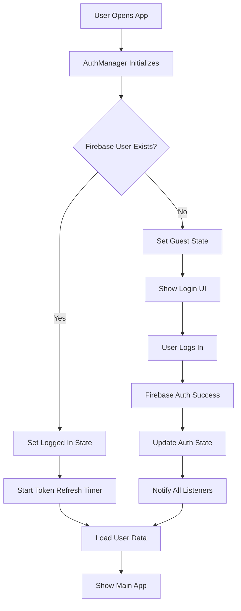
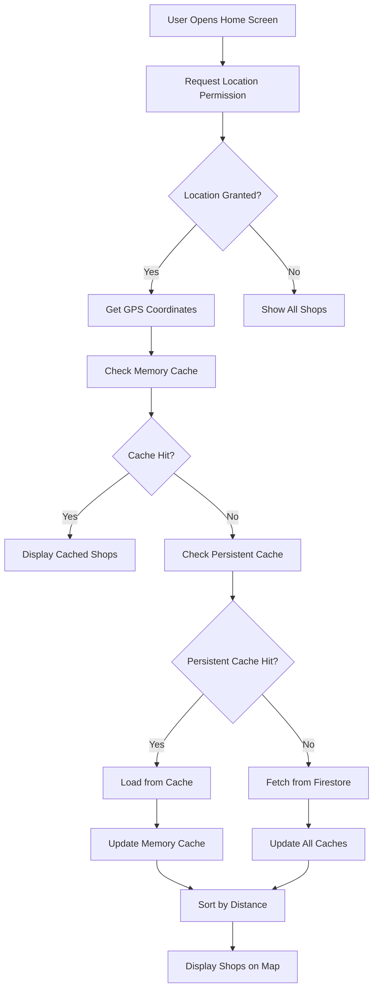
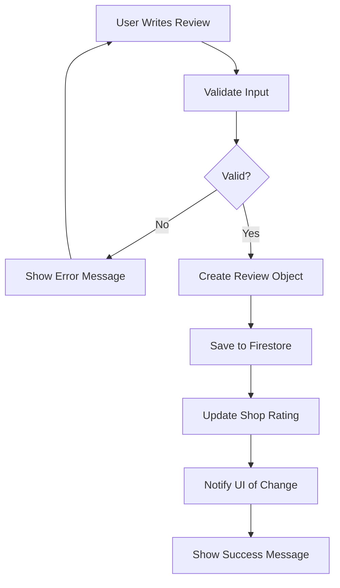

# 🏗️ Wonwonw2 Architecture Documentation

## **Table of Contents**
1. [System Overview](#system-overview)
2. [Architecture Patterns](#architecture-patterns)
3. [Data Flow](#data-flow)
4. [Service Layer](#service-layer)
5. [State Management](#state-management)
6. [UI Architecture](#ui-architecture)
7. [Security Architecture](#security-architecture)
8. [Performance Architecture](#performance-architecture)
9. [Deployment Architecture](#deployment-architecture)

---

## **System Overview**

### **High-Level Architecture**
```
┌─────────────────────────────────────────────────────────────────┐
│                        Client Layer (Flutter)                   │
├─────────────────────────────────────────────────────────────────┤
│  User App              │  Admin Portal        │  Shared Services │
│  ┌─────────────────┐   │  ┌─────────────────┐ │  ┌─────────────┐ │
│  │ • Shop Discovery│   │  │ • Shop Management│ │  │ • AuthManager│ │
│  │ • Reviews       │   │  │ • User Management│ │  │ • ShopService│ │
│  │ • Maps          │   │  │ • Moderation    │ │  │ • ReviewService│ │
│  │ • Saved Shops   │   │  │ • Analytics     │ │  │ • ForumService│ │
│  └─────────────────┘   │  └─────────────────┘ │  └─────────────┘ │
└─────────────────────────────────────────────────────────────────┘
┌─────────────────────────────────────────────────────────────────┐
│                        Firebase Backend                         │
├─────────────────────────────────────────────────────────────────┤
│  Firestore Database    │  Authentication    │  Storage          │
│  ┌─────────────────┐   │  ┌─────────────────┐ │  ┌─────────────┐ │
│  │ • Shops         │   │  │ • User Auth     │ │  │ • Images    │ │
│  │ • Reviews       │   │  │ • Admin Roles   │ │  │ • Documents │ │
│  │ • Forum Topics  │   │  │ • Session Mgmt  │ │  │ • Templates │ │
│  │ • User Data     │   │  │ • Token Refresh │ │  │ • Assets    │ │
│  └─────────────────┘   │  └─────────────────┘ │  └─────────────┘ │
└─────────────────────────────────────────────────────────────────┘
```

### **Core Principles**
- **Single Responsibility**: Each service has one clear purpose
- **Dependency Injection**: Services are injected, not instantiated
- **Immutable State**: State changes create new objects
- **Reactive Programming**: UI reacts to state changes
- **Fail-Safe Design**: Graceful error handling throughout

---

## **Architecture Patterns**

### **1. Clean Architecture (MVVM)**

#### **Layer Structure**
```
┌─────────────────────────────────────────────────────────────┐
│                    Presentation Layer                       │
│  ┌─────────────────┐  ┌─────────────────┐  ┌─────────────┐  │
│  │   Screens       │  │   Widgets       │  │   Mixins    │  │
│  │   (46 files)    │  │   (28 files)    │  │   (2 files) │  │
│  └─────────────────┘  └─────────────────┘  └─────────────┘  │
└─────────────────────────────────────────────────────────────┘
┌─────────────────────────────────────────────────────────────┐
│                    Business Logic Layer                     │
│  ┌─────────────────┐  ┌─────────────────┐  ┌─────────────┐  │
│  │   Services      │  │   Providers     │  │   Managers  │  │
│  │   (33 files)    │  │   (3 files)     │  │   (5 files) │  │
│  └─────────────────┘  └─────────────────┘  └─────────────┘  │
└─────────────────────────────────────────────────────────────┘
┌─────────────────────────────────────────────────────────────┐
│                      Data Layer                             │
│  ┌─────────────────┐  ┌─────────────────┐  ┌─────────────┐  │
│  │   Models        │  │   Repositories  │  │   Cache     │  │
│  │   (12 files)    │  │   (5 files)     │  │   (3 files) │  │
│  └─────────────────┘  └─────────────────┘  └─────────────┘  │
└─────────────────────────────────────────────────────────────┘
```

#### **Why This Pattern?**
- **Testability**: Each layer can be tested independently
- **Maintainability**: Changes in one layer don't affect others
- **Scalability**: Easy to add new features without breaking existing code
- **Separation of Concerns**: UI logic separate from business logic

### **2. Singleton Pattern**

#### **Implementation**
```dart
class AuthManager {
  static final AuthManager _instance = AuthManager._internal();
  factory AuthManager() => _instance;
  AuthManager._internal();
  
  // Instance methods and properties
}
```

#### **Used For:**
- **AuthManager**: Centralized authentication state
- **ServiceManager**: Service registration and discovery
- **UnifiedMemoryManager**: Memory management across app
- **PerformanceMonitor**: Performance tracking

#### **Why Singleton?**
- **Single Source of Truth**: One instance manages state
- **Memory Efficient**: No duplicate instances
- **Global Access**: Available throughout app
- **State Consistency**: All parts of app see same state

### **3. Provider Pattern**

#### **Implementation**
```dart
// main.dart
MultiProvider(
  providers: [
    ChangeNotifierProvider(create: (_) => AppStateManager()),
    Provider(create: (_) => AuthManager()),
    Provider(create: (_) => ShopService()),
  ],
  child: MaterialApp(...),
)

// Usage in widgets
class SomeWidget extends StatelessWidget {
  @override
  Widget build(BuildContext context) {
    final authManager = Provider.of<AuthManager>(context);
    return authManager.isLoggedIn ? LoggedInUI() : LoginUI();
  }
}
```

#### **Benefits:**
- **Reactive UI**: Widgets rebuild when state changes
- **Dependency Injection**: Services injected automatically
- **Testability**: Easy to mock providers in tests
- **Performance**: Only rebuilds widgets that depend on changed state

---

## **Data Flow**

### **1. User Authentication Flow**



#### **Code Implementation**
```dart
class AuthManager {
  Future<void> initialize() async {
    // Listen to Firebase auth state changes
    _authStateSubscription = FirebaseAuth.instance.authStateChanges().listen((user) {
      _currentUser = user;
      _isLoggedIn = user != null;
      
      // Notify all listeners
      _authStateController.add(_isLoggedIn);
      _userController.add(_currentUser);
      
      // Start token refresh if logged in
      if (user != null) {
        _startTokenRefreshTimer();
      }
    });
  }
}
```

### **2. Shop Discovery Flow**



#### **Code Implementation**
```dart
class ShopService {
  Future<List<RepairShop>> getAllShops() async {
    // 1. Check memory cache
    if (_memoryCache.isNotEmpty) {
      return _memoryCache.values.toList();
    }
    
    // 2. Check persistent cache
    final cachedShops = await _cacheService.getCachedShops();
    if (cachedShops != null) {
      _updateMemoryCache(cachedShops);
      return cachedShops;
    }
    
    // 3. Fetch from Firestore
    final shops = await _fetchFromFirestore();
    
    // 4. Update caches
    _updateMemoryCache(shops);
    await _cacheService.cacheShops(shops);
    
    return shops;
  }
}
```

### **3. Review Submission Flow**



---

## **Service Layer**

### **Core Services Architecture**

#### **Service Hierarchy**
```
ServiceManager (Singleton)
├── AuthManager
│   ├── AuthService
│   └── AuthStateService
├── ShopService
│   ├── ShopCacheService
│   └── LocationService
├── ReviewService
├── ForumService
│   └── ModeratorService
├── UserService
├── NotificationService
└── PerformanceMonitor
```

### **Service Responsibilities**

#### **1. AuthManager**
```dart
class AuthManager {
  // Centralized authentication state
  bool get isLoggedIn => _isLoggedIn;
  User? get currentUser => _currentUser;
  
  // Authentication methods
  Future<LoginResult> login(String email, String password);
  Future<void> logout();
  Future<bool> isAdmin();
  
  // Token management
  void _startTokenRefreshTimer();
  Future<void> _refreshAuthToken();
}
```

**Responsibilities:**
- Manage authentication state
- Handle login/logout operations
- Automatic token refresh
- Admin role checking
- Stream notifications for auth changes

#### **2. ShopService**
```dart
class ShopService {
  // Shop data management
  Future<List<RepairShop>> getAllShops();
  Future<RepairShop?> getShopById(String id);
  Future<void> addShop(RepairShop shop);
  Future<void> updateShop(RepairShop shop);
  
  // Caching
  void _updateMemoryCache(List<RepairShop> shops);
  Future<void> _cacheShops(List<RepairShop> shops);
}
```

**Responsibilities:**
- Fetch shop data from Firestore
- Manage shop caching (memory + persistent)
- Handle shop CRUD operations
- Distance calculation and sorting
- Cache invalidation

#### **3. ReviewService**
```dart
class ReviewService {
  // Review management
  Future<void> addReview({
    required String shopId,
    required String userId,
    required double rating,
    required String comment,
  });
  
  Future<void> addReplyToReview({
    required String shopId,
    required String reviewId,
    required ReviewReply reply,
  });
  
  Future<List<Review>> getReviews(String shopId);
}
```

**Responsibilities:**
- Manage review submissions
- Handle review replies
- Calculate average ratings
- Validate review content
- Moderate inappropriate content

### **Service Communication**

#### **Dependency Injection**
```dart
class ServiceManager {
  static final Map<Type, dynamic> _services = {};
  
  static void register<T>(T service) {
    _services[T] = service;
  }
  
  static T get<T>() {
    return _services[T] as T;
  }
}

// Usage
ServiceManager.register(AuthManager());
final authManager = ServiceManager.get<AuthManager>();
```

#### **Event-Driven Communication**
```dart
class ShopService {
  final StreamController<List<RepairShop>> _shopsController = 
      StreamController<List<RepairShop>>.broadcast();
  
  Stream<List<RepairShop>> get shopsStream => _shopsController.stream;
  
  void _notifyShopsChanged(List<RepairShop> shops) {
    _shopsController.add(shops);
  }
}
```

---

## **State Management**

### **State Architecture**

#### **State Hierarchy**
```
AppStateManager (Global State)
├── Authentication State
│   ├── isLoggedIn: bool
│   ├── currentUser: User?
│   └── isAdmin: bool
├── Shop State
│   ├── shops: List<RepairShop>
│   ├── savedShops: List<RepairShop>
│   └── filteredShops: List<RepairShop>
├── UI State
│   ├── isLoading: bool
│   ├── currentLanguage: String
│   └── isDarkMode: bool
└── Error State
    ├── error: String?
    └── retryCallback: VoidCallback?
```

### **State Management Implementation**

#### **AppStateManager**
```dart
class AppStateManager extends ChangeNotifier {
  // Authentication state
  bool _isLoggedIn = false;
  User? _currentUser;
  
  // Shop state
  List<RepairShop> _shops = [];
  List<RepairShop> _savedShops = [];
  
  // UI state
  bool _isLoading = false;
  String _currentLanguage = 'en';
  
  // Getters
  bool get isLoggedIn => _isLoggedIn;
  List<RepairShop> get shops => _shops;
  
  // State update methods
  void updateShops(List<RepairShop> shops) {
    _shops = shops;
    notifyListeners(); // Notify all listeners
  }
  
  void setLoading(bool loading) {
    _isLoading = loading;
    notifyListeners();
  }
}
```

#### **State Updates Flow**
```dart
// 1. Service updates state
class ShopService {
  Future<void> loadShops() async {
    final shops = await _fetchShops();
    _appStateManager.updateShops(shops);
  }
}

// 2. Widget listens to state changes
class ShopListWidget extends StatelessWidget {
  @override
  Widget build(BuildContext context) {
    return Consumer<AppStateManager>(
      builder: (context, appState, child) {
        return ListView.builder(
          itemCount: appState.shops.length,
          itemBuilder: (context, index) {
            return ShopCard(shop: appState.shops[index]);
          },
        );
      },
    );
  }
}
```

### **State Persistence**

#### **SharedPreferences Integration**
```dart
class AppStateManager {
  Future<void> _saveState() async {
    final prefs = await SharedPreferences.getInstance();
    await prefs.setBool('isLoggedIn', _isLoggedIn);
    await prefs.setString('currentLanguage', _currentLanguage);
    await prefs.setBool('isDarkMode', _isDarkMode);
  }
  
  Future<void> _loadState() async {
    final prefs = await SharedPreferences.getInstance();
    _isLoggedIn = prefs.getBool('isLoggedIn') ?? false;
    _currentLanguage = prefs.getString('currentLanguage') ?? 'en';
    _isDarkMode = prefs.getBool('isDarkMode') ?? false;
  }
}
```

---

## **UI Architecture**

### **Widget Hierarchy**

#### **Main App Structure**
```
MaterialApp
├── MultiProvider
│   ├── AppStateManager
│   ├── AuthManager
│   └── ShopService
└── MaterialApp
    ├── AuthGate (Authentication Wrapper)
    └── MainNavigation
        ├── DesktopNavigation (Desktop)
        └── CustomNavigationBar (Mobile)
```

#### **Screen Organization**
```
screens/
├── auth/
│   ├── login_screen.dart
│   ├── signup_screen.dart
│   └── forgot_password_screen.dart
├── user/
│   ├── home_screen.dart
│   ├── shop_detail_screen.dart
│   ├── saved_locations_screen.dart
│   └── profile_screen.dart
├── admin/
│   ├── admin_dashboard_main_screen.dart
│   ├── admin_manage_shops_screen.dart
│   └── admin_user_management_screen.dart
└── desktop/
    ├── desktop_home_screen.dart
    ├── desktop_saved_locations_screen.dart
    └── desktop_map_screen.dart
```

### **Responsive Design System**

#### **Breakpoint System**
```dart
class ResponsiveSize {
  static const double mobileBreakpoint = 768;
  static const double tabletBreakpoint = 1024;
  static const double desktopBreakpoint = 1200;
  
  static bool shouldShowDesktopLayout(BuildContext context) {
    return MediaQuery.of(context).size.width >= desktopBreakpoint;
  }
  
  static bool isTablet(BuildContext context) {
    final width = MediaQuery.of(context).size.width;
    return width >= tabletBreakpoint && width < desktopBreakpoint;
  }
}
```

#### **Responsive Widget Pattern**
```dart
class ResponsiveWidget extends StatelessWidget {
  final Widget mobile;
  final Widget? tablet;
  final Widget desktop;
  
  @override
  Widget build(BuildContext context) {
    if (ResponsiveSize.shouldShowDesktopLayout(context)) {
      return desktop;
    } else if (ResponsiveSize.isTablet(context) && tablet != null) {
      return tablet!;
    } else {
      return mobile;
    }
  }
}
```

### **Widget Composition**

#### **Reusable Components**
```dart
// Base widget with common functionality
class BaseScreen extends StatelessWidget {
  final String title;
  final Widget body;
  final List<Widget>? actions;
  
  @override
  Widget build(BuildContext context) {
    return Scaffold(
      appBar: AppBar(
        title: Text(title),
        actions: actions,
      ),
      body: body,
    );
  }
}

// Specialized screen
class ShopDetailScreen extends StatelessWidget {
  @override
  Widget build(BuildContext context) {
    return BaseScreen(
      title: 'Shop Details',
      body: _buildShopContent(),
      actions: [_buildActionButtons()],
    );
  }
}
```

---

## **Security Architecture**

### **Authentication Security**

#### **Multi-Layer Security**
```
┌─────────────────────────────────────────────────────────────┐
│                    Client Security                          │
│  ┌─────────────────┐  ┌─────────────────┐  ┌─────────────┐  │
│  │ Input Validation│  │ Rate Limiting   │  │ Token Mgmt  │  │
│  └─────────────────┘  └─────────────────┘  └─────────────┘  │
└─────────────────────────────────────────────────────────────┘
┌─────────────────────────────────────────────────────────────┐
│                    Server Security                          │
│  ┌─────────────────┐  ┌─────────────────┐  ┌─────────────┐  │
│  │ Firebase Auth   │  │ Firestore Rules │  │ Admin Roles │  │
│  └─────────────────┘  └─────────────────┘  └─────────────┘  │
└─────────────────────────────────────────────────────────────┘
```

#### **Input Validation**
```dart
class ValidationUtils {
  static bool isValidEmail(String email) {
    return RegExp(r'^[\w-\.]+@([\w-]+\.)+[\w-]{2,4}$').hasMatch(email);
  }
  
  static String sanitizeInput(String input) {
    return input
        .trim()
        .replaceAll(RegExp(r'<[^>]*>'), '') // Remove HTML tags
        .replaceAll(RegExp(r'[<>"\']'), ''); // Remove dangerous chars
  }
  
  static bool isStrongPassword(String password) {
    return password.length >= 8 && 
           RegExp(r'[A-Z]').hasMatch(password) &&
           RegExp(r'[0-9]').hasMatch(password);
  }
}
```

#### **Rate Limiting**
```dart
class AuthService {
  static const int _maxLoginAttempts = 5;
  static const Duration _lockoutDuration = Duration(minutes: 15);
  
  Future<void> _recordFailedAttempt(String email) async {
    final prefs = await SharedPreferences.getInstance();
    final attempts = prefs.getInt('${_loginAttemptsKey}_$email') ?? 0;
    
    if (attempts + 1 >= _maxLoginAttempts) {
      final lockoutUntil = DateTime.now().add(_lockoutDuration);
      await prefs.setString(
        '${_lockoutUntilKey}_$email',
        lockoutUntil.toIso8601String(),
      );
    }
  }
}
```

### **Data Security**

#### **Firestore Security Rules**
```javascript
// Firestore security rules
rules_version = '2';
service cloud.firestore {
  match /databases/{database}/documents {
    // Shops collection - public read, admin write
    match /shops/{shopId} {
      allow read: if true;
      allow write: if isAdmin();
      
      // Reviews subcollection
      match /reviews/{reviewId} {
        allow read: if true;
        allow create: if isAuthenticated();
        allow update, delete: if isOwner(resource.data.userId) || isAdmin();
      }
    }
    
    // Users collection - user can only access their own data
    match /users/{userId} {
      allow read, write: if isOwner(userId);
    }
  }
  
  function isAuthenticated() {
    return request.auth != null;
  }
  
  function isAdmin() {
    return isAuthenticated() && 
           get(/databases/$(database)/documents/users/$(request.auth.uid)).data.role == 'admin';
  }
  
  function isOwner(userId) {
    return isAuthenticated() && request.auth.uid == userId;
  }
}
```

---

## **Performance Architecture**

### **Caching Strategy**

#### **Multi-Layer Caching**
```
┌─────────────────────────────────────────────────────────────┐
│                    Memory Cache (L1)                        │
│  • Fastest access (< 1ms)                                  │
│  • Limited size (100 items)                                │
│  • Lost on app restart                                     │
└─────────────────────────────────────────────────────────────┘
┌─────────────────────────────────────────────────────────────┐
│                Persistent Cache (L2)                        │
│  • Fast access (< 10ms)                                    │
│  • SharedPreferences storage                               │
│  • Survives app restarts                                   │
└─────────────────────────────────────────────────────────────┘
┌─────────────────────────────────────────────────────────────┐
│                    Firestore (L3)                           │
│  • Network access (100-1000ms)                             │
│  • Source of truth                                         │
│  • Real-time updates                                       │
└─────────────────────────────────────────────────────────────┘
```

#### **Cache Implementation**
```dart
class ShopCacheService {
  static const String _cacheKey = 'cached_shops';
  static const Duration _cacheDuration = Duration(hours: 1);
  
  Future<void> cacheShops(List<RepairShop> shops) async {
    final prefs = await SharedPreferences.getInstance();
    final cacheData = {
      'shops': shops.map((s) => s.toMap()).toList(),
      'timestamp': DateTime.now().millisecondsSinceEpoch,
    };
    await prefs.setString(_cacheKey, jsonEncode(cacheData));
  }
  
  Future<List<RepairShop>?> getCachedShops() async {
    final prefs = await SharedPreferences.getInstance();
    final cacheString = prefs.getString(_cacheKey);
    
    if (cacheString == null) return null;
    
    final cacheData = jsonDecode(cacheString);
    final timestamp = DateTime.fromMillisecondsSinceEpoch(cacheData['timestamp']);
    
    // Check if cache is still valid
    if (DateTime.now().difference(timestamp) > _cacheDuration) {
      await clearCache();
      return null;
    }
    
    return (cacheData['shops'] as List)
        .map((s) => RepairShop.fromMap(s))
        .toList();
  }
}
```

### **Memory Management**

#### **UnifiedMemoryManager**
```dart
class UnifiedMemoryManager {
  static final Map<String, WeakReference<Object>> _objects = {};
  static Timer? _cleanupTimer;
  
  // Register object for tracking
  static void registerObject(String key, Object object) {
    _objects[key] = WeakReference(object);
    _scheduleCleanup();
  }
  
  // Automatic cleanup every 30 seconds
  static void _scheduleCleanup() {
    _cleanupTimer?.cancel();
    _cleanupTimer = Timer(Duration(seconds: 30), () {
      _performCleanup();
    });
  }
  
  // Remove dead references
  static void _performCleanup() {
    _objects.removeWhere((key, ref) => ref.target == null);
    appLog('Memory cleanup completed. Active objects: ${_objects.length}');
  }
}
```

### **Performance Monitoring**

#### **Performance Tracking**
```dart
class PerformanceMonitor {
  static final Map<String, Stopwatch> _timers = {};
  static final Map<String, List<Duration>> _measurements = {};
  
  static void startOperation(String operationName) {
    _timers[operationName] = Stopwatch()..start();
  }
  
  static Duration endOperation(String operationName) {
    final timer = _timers[operationName];
    if (timer != null) {
      timer.stop();
      final duration = timer.elapsed;
      
      _measurements.putIfAbsent(operationName, () => []).add(duration);
      _timers.remove(operationName);
      
      appLog('Performance: $operationName took ${duration.inMilliseconds}ms');
      return duration;
    }
    return Duration.zero;
  }
}
```

---

## **Deployment Architecture**

### **Multi-Environment Setup**

#### **Environment Configuration**
```dart
// main.dart
void main() async {
  WidgetsFlutterBinding.ensureInitialized();
  
  // Initialize Firebase
  await Firebase.initializeApp(
    options: DefaultFirebaseOptions.currentPlatform,
  );
  
  // Configure for different environments
  if (kIsWeb) {
    await _configureWeb();
  } else {
    await _configureMobile();
  }
  
  runApp(OptimizedWonWonApp(initialLocale: Locale('en')));
}

Future<void> _configureWeb() async {
  // Web-specific configuration
  setUrlStrategy(PathUrlStrategy());
  await _configureWebFonts();
}

Future<void> _configureMobile() async {
  // Mobile-specific configuration
  await _configureLocationServices();
}
```

#### **Build Configurations**
```bash
# User App Build
flutter build web --web-renderer html --release

# Admin Portal Build
flutter build web --web-renderer html --release --dart-define=FORCE_ADMIN_MODE=true

# Mobile Builds
flutter build apk --release
flutter build ios --release
```

### **Firebase Hosting Configuration**

#### **firebase.json**
```json
{
  "hosting": [
    {
      "target": "main",
      "public": "build/web",
      "rewrites": [
        {
          "source": "**",
          "destination": "/index.html"
        }
      ]
    },
    {
      "target": "admin",
      "public": "build/web",
      "rewrites": [
        {
          "source": "**",
          "destination": "/index.html"
        }
      ]
    }
  ]
}
```

### **CI/CD Pipeline**

#### **GitHub Actions Workflow**
```yaml
name: CI/CD Pipeline
on:
  push:
    branches: [ main, develop ]
  pull_request:
    branches: [ main, develop ]

jobs:
  test:
    runs-on: ubuntu-latest
    steps:
    - uses: actions/checkout@v3
    - name: Setup Flutter
      uses: subosito/flutter-action@v2
      with:
        flutter-version: '3.16.0'
    - name: Run tests
      run: flutter test --coverage
    - name: Analyze code
      run: dart analyze --fatal-infos

  build:
    runs-on: ubuntu-latest
    needs: test
    steps:
    - name: Build web
      run: flutter build web --release
    - name: Upload artifacts
      uses: actions/upload-artifact@v3

  deploy:
    runs-on: ubuntu-latest
    needs: [test, build]
    if: github.ref == 'refs/heads/main'
    steps:
    - name: Deploy to Firebase
      uses: FirebaseExtended/action-hosting-deploy@v0
```

---

## **Key Design Decisions**

### **1. Why Flutter?**
- **Cross-platform**: Single codebase for mobile, web, desktop
- **Performance**: Native performance with hot reload
- **Ecosystem**: Rich package ecosystem
- **Google Support**: Excellent Firebase integration

### **2. Why Firebase?**
- **Backend-as-a-Service**: No server management needed
- **Real-time**: Live data synchronization
- **Scalability**: Automatic scaling
- **Security**: Built-in security rules

### **3. Why Provider Pattern?**
- **Simplicity**: Easy to understand and implement
- **Performance**: Efficient rebuilds
- **Testability**: Easy to mock and test
- **Flutter Native**: Recommended by Flutter team

### **4. Why Clean Architecture?**
- **Testability**: Each layer can be tested independently
- **Maintainability**: Changes don't affect other layers
- **Scalability**: Easy to add new features
- **Separation of Concerns**: Clear responsibilities

---

## **Future Architecture Considerations**

### **Microservices Migration**
```
Current: Monolithic Flutter App
Future: Microservices Architecture

┌─────────────────┐    ┌─────────────────┐    ┌─────────────────┐
│   User Service  │    │   Shop Service  │    │   Review Service│
│   (Flutter)     │◄──►│   (Node.js)     │◄──►│   (Python)      │
└─────────────────┘    └─────────────────┘    └─────────────────┘
```

### **Event-Driven Architecture**
```dart
// Future: Event-driven communication
class EventBus {
  static final EventBus _instance = EventBus._internal();
  factory EventBus() => _instance;
  
  final StreamController<AppEvent> _eventController = 
      StreamController<AppEvent>.broadcast();
  
  void publish(AppEvent event) {
    _eventController.add(event);
  }
  
  Stream<AppEvent> get events => _eventController.stream;
}
```

---

**This architecture documentation provides a comprehensive understanding of how the Wonwonw2 app is structured and how all components work together. It serves as a guide for developers joining the project and helps maintain consistency as the app evolves.**
